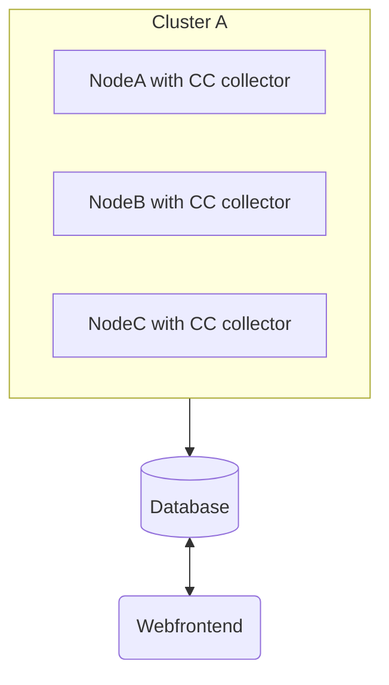
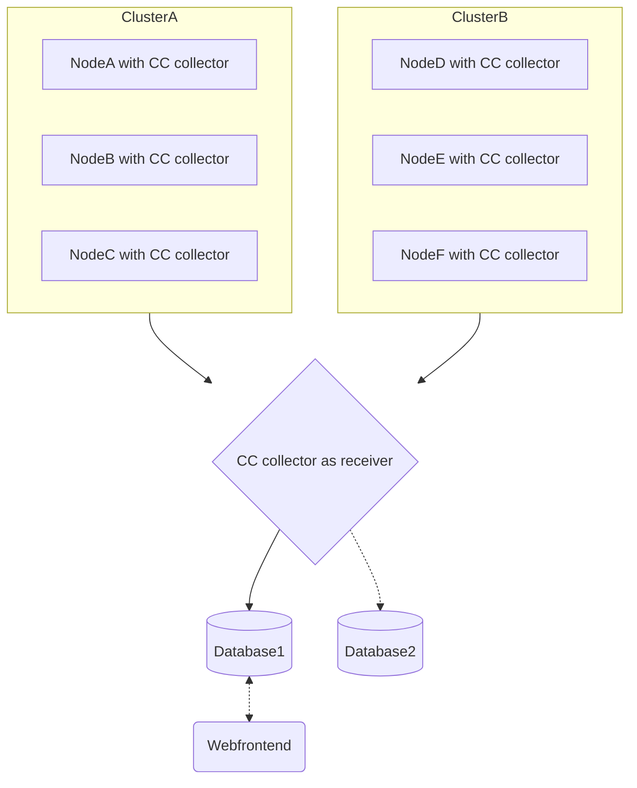

<!--
---
title: cc-metric-collector
description: Metric collecting node agent
categories: [cc-metric-collector]
tags: ['Admin']
weight: 2
hugo_path: docs/reference/cc-metric-collector/_index.md
---
-->

# cc-metric-collector

A node agent for measuring, processing and forwarding node level metrics. It is part of the [ClusterCockpit ecosystem](https://clustercockpit.org/docs/overview/).

The metric collector sends (and receives) metric in the [InfluxDB line protocol](https://docs.influxdata.com/influxdb/cloud/reference/syntax/line-protocol/) as it provides flexibility while providing a separation between tags (like index columns in relational databases) and fields (like data columns).

There is a single timer loop that triggers all collectors serially, collects the collectors' data and sends the metrics to the sink. This is done as all data is submitted with a single time stamp. The sinks currently use mostly blocking APIs.

The receiver runs as a go routine side-by-side with the timer loop and asynchronously forwards received metrics to the sink.


[](https://doi.org/10.5281/zenodo.7438287)


# Configuration

Configuration is implemented using a single json document that is distributed over network and may be persisted as file.
Supported metrics are documented [here](https://github.com/ClusterCockpit/cc-specifications/blob/master/interfaces/lineprotocol/README.md).

There is a main configuration file with basic settings that point to the other configuration files for the different components.

``` json
{
  "sinks": "sinks.json",
  "collectors" : "collectors.json",
  "receivers" : "receivers.json",
  "router" : "router.json",
  "interval": "10s",
  "duration": "1s"
}
```

The `interval` defines how often the metrics should be read and send to the sink. The `duration` tells collectors how long one measurement has to take. This is important for some collectors, like the `likwid` collector. For more information, see [here](./docs/configuration.md).

See the component READMEs for their configuration:

* [`collectors`](./collectors/README.md)
* [`sinks`](https://github.com/ClusterCockpit/cc-lib/blob/main/sinks/README.md)
* [`receivers`](https://github.com/ClusterCockpit/cc-lib/blob/main/receivers/README.md)
* [`router`](./internal/metricRouter/README.md)

# Installation

```
$ git clone git@github.com:ClusterCockpit/cc-metric-collector.git
$ make (downloads LIKWID, builds it as static library with 'direct' accessmode and copies all required files for the collector)
$ go get (requires at least golang 1.16)
$ make
```

For more information, see [here](./docs/building.md).

# Running

```
$ ./cc-metric-collector --help
Usage of metric-collector:
  -config string
    	Path to configuration file (default "./config.json")
  -log string
    	Path for logfile (default "stderr")
  -once
    	Run all collectors only once
```

# Scenarios

The metric collector was designed with flexibility in mind, so it can be used in many scenarios. Here are a few:





# Contributing

The ClusterCockpit ecosystem is designed to be used by different HPC computing centers. Since configurations and setups differ between the centers, the centers likely have to put some work into the cc-metric-collector to gather all desired metrics.

You are free to open an issue to request a collector but we would also be happy about PRs.

# Contact

* [Matrix.org ClusterCockpit General chat](https://matrix.to/#/#clustercockpit-dev:matrix.org)
* [Matrix.org ClusterCockpit Development chat](https://matrix.to/#/#clustercockpit:matrix.org)
