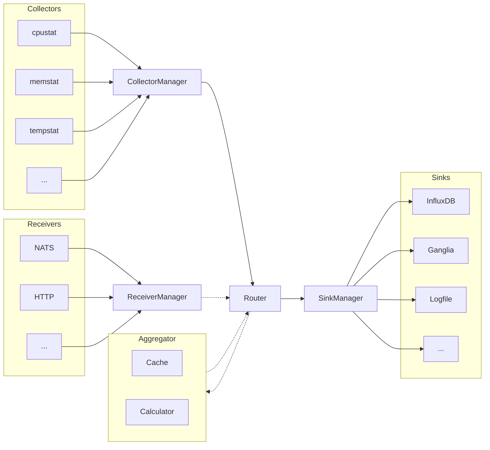

# Configuring the CC metric collector

The configuration of the CC metric collector consists of five configuration files: one global file and four component related files.

## Global configuration

The global file contains the paths to the other four files and some global options. You can find examples in `example_configs`.

```json
{
  "sinks": "sinks.json",
  "collectors" : "collectors.json",
  "receivers" : "receivers.json",
  "router" : "router.json",
  "interval": "10s",
  "duration": "1s"
}
```

Be aware that the paths are relative to the execution folder of the cc-metric-collector binary, so it is recommended to use absolute paths.

## Component configuration

The others are mainly list of of subcomponents: the collectors, the receivers, the router and the sinks. Their role is best shown in a picture:



There are four parts:
- The collectors read data from files, execute commands and call dynamically loaded library function and send it to the router
- The router can process metrics by cacheing and evaluating functions and conditions on them
- The sinks send the metrics to storage backends
- The receivers can be used to receive metrics from other collectors and forward them to the router. They can be used to create a tree-like structure of collectors.

(A maybe better differentiation between collectors and receivers is that the collectors are called periodically while the receivers have their own logic and submit metrics at any time)


### Collectors configuration file

The collectors configuration file tells which metrics should be queried from the system. The metric gathering is logically grouped in so called 'Collectors'. So there are Collectors to read CPU, memory or filesystem statistics. The collectors configuration file is a list of these collectors with collector-specific configurations:

```json
{
  "cpustat" : {},
  "diskstat": {
    "exclude_metrics": [
      "disk_total"
    ]
  }
}
```

The first one is the CPU statistics collector without any collector-specific setting. The second one enables disk mount statistics but excludes the metric `disk_total`.

All names and possible collector-specific configuration options can be found [here](../collectors/README.md).

Some collectors might dynamically load shared libraries. In order to enable these collectors, make sure that the shared library path is part of the `LD_LIBRARY_PATH` environment variable.

### Sinks configuration file

The sinks define the output/sending of metrics. The metrics can be forwarded to multiple sinks, even to sinks of the same type. The sinks configuration file is a list of these sinks, each with an individual name.

```json
{
  "myinflux" : {
    "type" : "influxasync",
    "host": "localhost",
    "port": "8086",
    "organization" : "testorga",
    "database" : "testbucket",
    "password" : "<my secret JWT>"
  },
  "companyinflux" : {
    "type" : "influxasync",
    "host": "companyhost",
    "port": "8086",
    "organization" : "company",
    "database" : "main",
    "password" : "<company's secret JWT>"
  }
}
```

The above example configuration file defines two sink, both ot type `influxasync`. They are differentiated internally by the names: `myinflux` and `companyinflux`.

All types and possible sink-specific configuration options can be found [here](../sinks/README.md).

Some sinks might dynamically load shared libraries. In order to enable these sinks, make sure that the shared library path is part of the `LD_LIBRARY_PATH` environment variable.

### Router configuration file

The collectors and the sinks are connected through the router. The router forwards the metrics to the sinks but enables some data processing. A common example is to tag all passing metrics like adding `cluster=mycluster`. But also aggregations like "take the average of all 'ipc' metrics" (ipc -> Instructions Per Cycle). Since the configurations of these aggregations can be quite complicated, we refer to the router's [README](../internal/metricRouter/README.md).

A simple router configuration file to start with looks like this:

```json
{
    "add_tags" : [
        {
            "key" : "cluster",
            "value" : "mycluster",
            "if" : "*"
        }
    ],
    "interval_timestamp" : false,
    "num_cache_intervals" : 0
}
```

With the `add_tags` section, we tell to attach the `cluster=mycluster` tag to each (`*` metric). The `interval_timestamp` tell the router to not touch the timestamp of metrics. It is possible to send all metrics within an interval with a common time stamp to avoid later alignment issues. The `num_cache_intervals` diables the cache completely. The cache is only required if you want to do complex metric aggregations.

All configuration options can be found [here](../internal/metricRouter/README.md).

### Receivers configuration file

The receivers are a special feature of the CC Metric Collector to enable simpler integration into exising setups. While collectors query data from the local system, the receivers commonly get data from other systems through some network technology like HTTP or NATS. The idea is keep the current setup but send it to a CC Metric Collector which forwards it to the the destination system (if a sink exists for it). For most setups, the receivers are not required and an the receiver config file should contain only an empty JSON map (`{}`). 

```json
{
  "nats_rack0": {
    "type": "nats",
    "address" : "nats-server.example.org",
    "port" : "4222",
    "subject" : "rack0",
  },
  "nats_rack1": {
    "type": "nats",
    "address" : "nats-server.example.org",
    "port" : "4222",
    "subject" : "rack1",
  }
}
```

This example configuration creates two receivers with the names `nats_rack0` and `nats_rack1`. While one subscribes to metrics published with the `rack0` subject, the other one subscribes to the `rack0` subject. The NATS server is the same as it manages all subjects in a subnet. (As example, the router could add tags `rack=0` and `rack=1` respectively to the received metrics.)

All types and possible receiver-specific configuration options can be found [here](../receivers/README.md).
